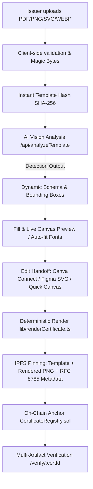
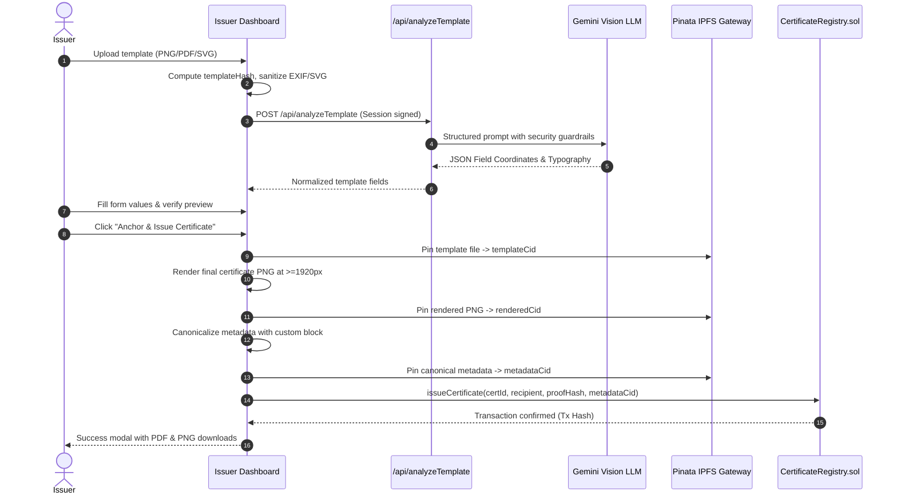
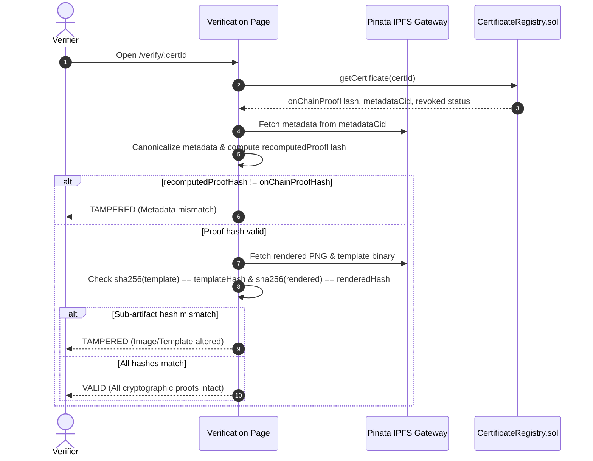

# Custom Certificate Architecture & Integration Guide

CertiChain Ledger provides a zero-contract-migration "Custom Certificate" extension that allows authorized issuers to upload custom-designed certificates, automatically detect variable and static fields using AI Vision or local OCR fallback, edit layouts directly or via Canva/Figma handoff, issue certificates anchored with cryptographic proof hashes, and verify multi-artifact integrity on-chain.

---

## 1. System Architecture



---

## 2. Sequence Diagrams

### 2.1 Upload, Analysis, and Issuance Flow



### 2.2 Verification Flow



---

## 3. Provider Capability Matrix

| Feature / Capability | Canva Connect | Figma | Built-in Quick Editor |
| :--- | :--- | :--- | :--- |
| **Connection Protocol** | OAuth 2.0 PKCE Authorization Code | SVG layer import & Plugin Deep Link | Direct Client-side DOM/Canvas |
| **Setup Requirement** | Canva Developer App Client ID & Secret | Figma Desktop App / Web + Plugin | None (Zero-dependency) |
| **Asset Export** | PNG/PDF via Connect Export API | Export frame via plugin or upload | In-memory canvas export |
| **Deterministic Layer Tagging**| Visual OCR / Diff Detection | `field:<key>` Layer Names | Direct field bindings |
| **Offline / Air-gapped Support**| ❌ Requires Internet | ❌ Requires Internet | ✅ Works 100% Offline |

---

## 4. Setup & Configuration

### 4.1 Environment Variables
Add the following keys to your `.env` in root and `frontend/`:

```env
# AI Vision Analysis (Default: Gemini)
AI_PROVIDER=gemini
AI_API_KEY=your_gemini_api_key_here
AI_MODEL=gemini-1.5-flash

# Canva Connect Integration
CANVA_CLIENT_ID=your_canva_client_id
CANVA_CLIENT_SECRET=your_canva_client_secret
CANVA_REDIRECT_URI=http://localhost:5173/api/canva/callback

# Serverless Session Signing Secret
SESSION_SECRET=a_random_32_character_secret_string
```

### 4.2 Canva Developer App Setup
1. Go to [Canva Developers Portal](https://www.canva.com/developers).
2. Create a new Integration with scopes: `design:content:read`, `design:content:write`, `design:meta:read`.
3. Add redirect URL: `http://localhost:5173/api/canva/callback` (or your production URL).
4. Copy Client ID and Client Secret into your `.env`.

### 4.3 Figma Plugin Setup
1. In Figma, go to **Plugins** -> **Development** -> **Import plugin from manifest...**.
2. Select `figma-plugin/manifest.json`.
3. The plugin will open and allow importing templates and syncing frame layers tagged with `field:<key>`.

---

## 5. Security & Privacy Guarantees

1. **Anti-Prompt Injection**: Uploaded certificate text is treated strictly as untrusted visual data. The vision prompt instructions strictly prevent the model from executing or obeying any instructions printed on the certificate design.
2. **Secret Isolation**: Pinata JWT, Gemini API key, and Canva secrets are exclusively accessed via serverless endpoints. No secrets are ever packaged in the frontend bundle.
3. **EXIF & Privacy**: EXIF and GPS geolocation metadata are automatically stripped client-side prior to IPFS pinning.
4. **SVG Sanitization**: Strict DOMPurify profiles disallow external references, `<script>` tags, and `foreignObject` tags.
